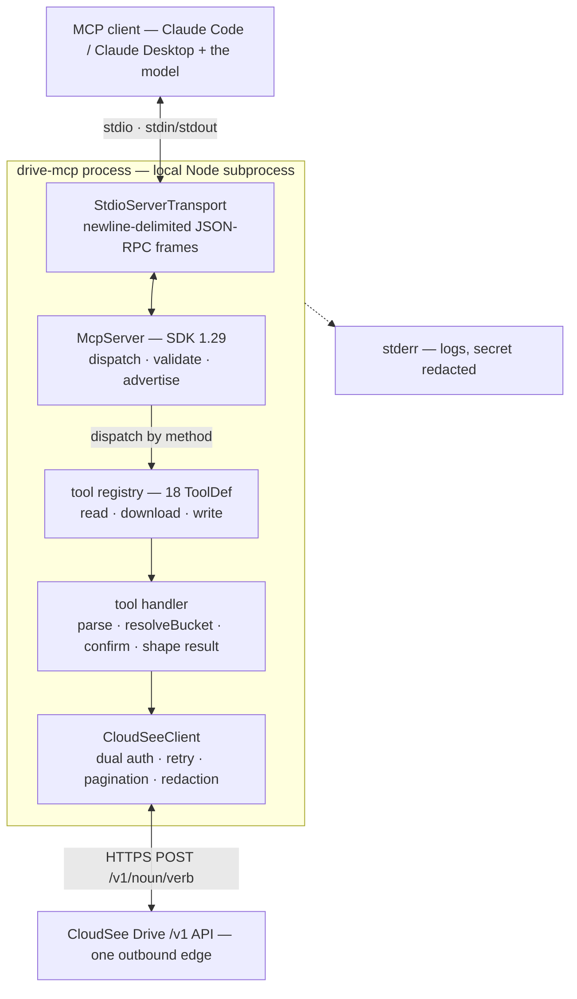
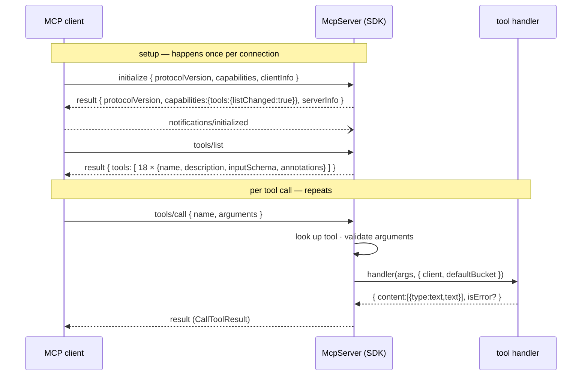
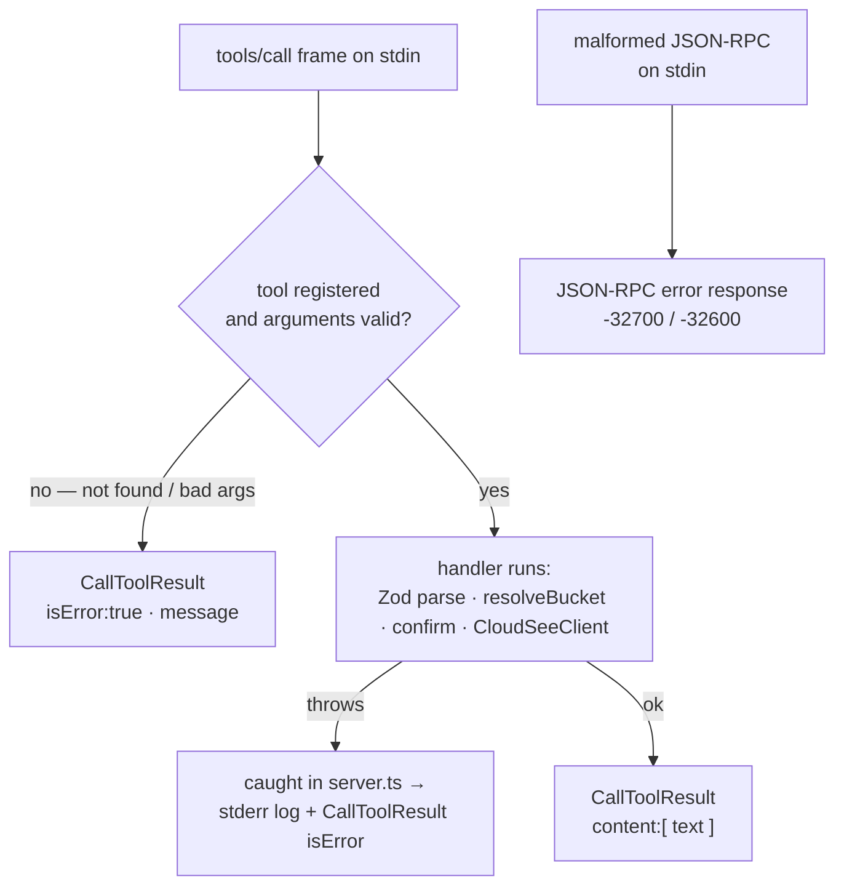
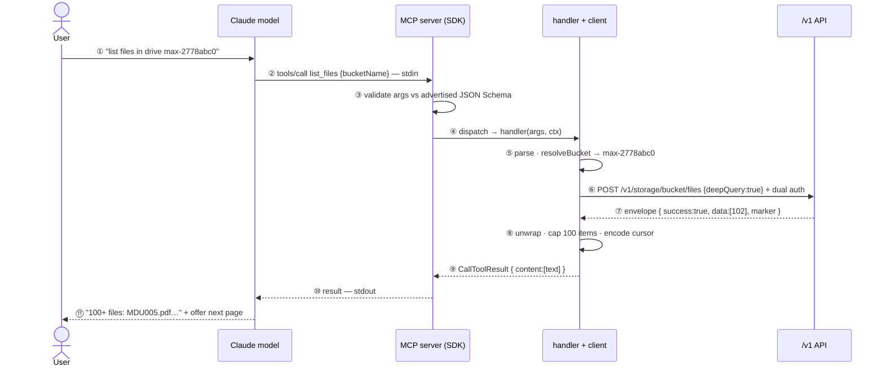

# How the MCP server works — drive-mcp internals & the MCP protocol

A detailed look at the **MCP mechanism** inside `cloudsee-drive-mcp`: the process model, the stdio
transport and JSON-RPC framing, the connection handshake, how tools are advertised
(`tools/list`) and invoked (`tools/call`), how results and errors flow, and where the secret is
kept safe. The CloudSee `/v1/*` API is treated here as a single **outbound edge** — for the
tool → endpoint mapping see the [reference appendix](#appendix-a--tool--endpoint-reference) and the
[GUIDE](GUIDE.md).

Grounded in the package source (`src/**`) and the bundled SDK (`@modelcontextprotocol/sdk` 1.29).

---

## 1. What "the MCP server" is here

`cloudsee-drive-mcp` is **one local Node subprocess**. The MCP host (Claude Code, Claude Desktop,
any MCP client) spawns it and talks to it over **stdio** — there is no network listener, no port,
no daemon. The model never calls CloudSee directly; it calls **tools**, and this process turns each
tool call into an authenticated HTTPS request.



Everything blue above is in this repo; the API is the one thing it doesn't own.

---

## 2. Startup — how the process wires itself up

`main()` in [`src/index.ts`](../src/index.ts) runs a fixed chain before a single message is read:

1. **`loadConfig()`** ([`src/config.ts`](../src/config.ts)) — validates the environment with Zod
   (`CLOUDSEE_API_KEY_ID`, `_SECRET`, optional base URL / default bucket / timeout / log level). A
   missing credential is fatal and printed to **stderr**, then `process.exit(1)`.
2. **`configureLogger({ level, redact: [secret] })`** ([`src/logger.ts`](../src/logger.ts)) —
   registers the secret for redaction **before anything else can log**.
3. **`createServer(config, tools)`** ([`src/server.ts`](../src/server.ts)) — constructs one
   `CloudSeeClient`, one `McpServer`, and registers the tool set it is handed (next section).
   `allTools` (stdio) holds 19; `hostedTools` holds 18 — the shared names differ only in the
   `upload_file` variant, and `upload_status` is stdio-only because only stdio starts background uploads
   ([`src/tools/index.ts`](../src/tools/index.ts)).
4. **`new StdioServerTransport()`** + **`server.connect(transport)`** — the SDK calls
   `transport.start()`, which attaches the `data`/`error` listeners on `process.stdin` and wires the
   SDK's request handlers (`initialize`, `tools/list`, `tools/call`, …). From here the process is
   message-driven.

```ts
// src/server.ts — the registration loop (one shared client across all tools)
for (const tool of allTools) {
  server.registerTool(
    tool.name,
    { title: tool.title, description: tool.description,
      inputSchema: tool.inputSchema, annotations: { title: tool.title, ...tool.annotations } },
    async (args) => {
      try {
        return await tool.handler(args ?? {}, { client, defaultBucket: config.defaultBucket });
      } catch (err) {
        const message = err instanceof Error ? err.message : String(err);
        logger.error(`tool "${tool.name}" failed`, message);   // → stderr, redacted
        return { content: [{ type: "text", text: `Error: ${message}` }], isError: true };
      }
    },
  );
}
```

That per-tool `try/catch` is deliberate: it converts any handler throw into a clean `isError`
result **and** logs it to stderr with the secret redacted — see §6 for why that matters.

---

## 3. Transport & framing — JSON-RPC 2.0 over stdio

MCP messages are **JSON-RPC 2.0**. Over stdio the framing is dead simple: **one JSON message per
line.** From the SDK ([`shared/stdio.js`](../node_modules/@modelcontextprotocol/sdk/dist/esm/shared/stdio.js)):

```js
export function serializeMessage(message) { return JSON.stringify(message) + '\n'; }
// ReadBuffer.readMessage() splits stdin on '\n', strips a trailing '\r', JSON.parses the line.
```

Consequences that shape the whole design:

- **stdin** carries requests/notifications *into* the server; **stdout** carries
  responses/notifications *out*. The client process holds the other ends.
- **stdout is the transport — it must contain only protocol frames.** A stray `console.log` writes a
  non-JSON line that the peer's `ReadBuffer` tries to `JSON.parse`, corrupting the stream. That is
  exactly why all logging goes to **stderr** ([`src/logger.ts`](../src/logger.ts)) and config errors
  are written to stderr, never stdout ([`src/index.ts:11-14`](../src/index.ts)).
- Messages are newline-delimited, so a frame may not contain a raw newline — `JSON.stringify`
  guarantees that.

Three message kinds travel over this channel: **requests** (have `id` + `method`), **responses**
(have `id` + `result` *or* `error`), and **notifications** (have `method`, no `id`, no reply).

---

## 4. The connection lifecycle (handshake)

`server.connect()` doesn't send anything — the **client drives** the handshake. The SDK negotiates a
protocol version (it supports `2025-11-25` … `2024-10-07`; latest is `2025-11-25`) and declares the
server's capabilities. `McpServer` registers `tools: { listChanged: true }`
([`server/mcp.js:62-66`](../node_modules/@modelcontextprotocol/sdk/dist/esm/server/mcp.js)).



The actual frames on the wire (one per line):

```jsonc
// → client to server
{"jsonrpc":"2.0","id":0,"method":"initialize","params":{"protocolVersion":"2025-11-25","capabilities":{},"clientInfo":{"name":"claude-ai","version":"…"}}}
// ← server to client
{"jsonrpc":"2.0","id":0,"result":{"protocolVersion":"2025-11-25","capabilities":{"tools":{"listChanged":true}},"serverInfo":{"name":"cloudsee-drive-mcp","version":"0.1.0"}}}
// → notification (no id, no reply)
{"jsonrpc":"2.0","method":"notifications/initialized"}
```

`serverInfo.name`/`version` come straight from `new McpServer({ name: "cloudsee-drive-mcp", version: VERSION })`
([`src/server.ts:16`](../src/server.ts)). The [`scripts/smoke.mjs`](../scripts/smoke.mjs) test performs
exactly this handshake + `tools/list` and asserts 19 tools — fully offline, since listing makes no API call.

---

## 5. `tools/list` — how a tool is advertised

When the client asks for the catalog, the SDK enumerates the registered tools and, for each, emits
`{ name, title, description, inputSchema, annotations }`
([`server/mcp.js:67-99`](../node_modules/@modelcontextprotocol/sdk/dist/esm/server/mcp.js)). The
important part: **the Zod input schema is converted to JSON Schema** (via `zod-to-json-schema`,
`pipeStrategy:'input'`) — that JSON Schema is what the model sees and fills in.

So a tool authored as a Zod shape in [`src/tools/write.ts`](../src/tools/write.ts):

```ts
const deleteObjectSchema = z.object({
  key: z.string().min(1).describe("Exact object key as returned by a listing tool (folders keep their trailing slash)."),
  isFolder: z.boolean().optional().describe("Set true for a folder."),
  storageId: storageIdField,                                // StorageId from the indexed listing tools
});
const deleteSchema = z.object({
  bucketName: bucketField,                                  // optional string
  objects: z.array(deleteObjectSchema).min(1).describe("Objects to permanently delete (one queued request per object)."),
  ...confirmShape,                                          // confirm?: boolean
});
```

is advertised to the model roughly as (illustrative — field order/extras trimmed):

```jsonc
{
  "name": "delete_files",
  "title": "Delete files",
  "description": "Permanently delete one or more files/folders from a drive, each addressed by its exact object key plus its storage id … Queued: returns a RequestId per object … Requires confirm=true. (…scope note…)",
  "inputSchema": {
    "type": "object",
    "properties": {
      "bucketName": { "type": "string", "minLength": 1, "description": "The CloudSee drive (S3 bucket) name …" },
      "objects": {
        "type": "array", "minItems": 1, "description": "Objects to permanently delete (one queued request per object).",
        "items": { "type": "object", "properties": { "key": { "type": "string", "minLength": 1 }, "isFolder": { "type": "boolean" }, "storageId": { "type": "string", "minLength": 1 } }, "required": ["key", "storageId"] }
      },
      "confirm":    { "type": "boolean", "description": "Must be true to actually perform this mutating/irreversible action. …" }
    },
    "required": ["objects"]
  },
  "annotations": { "title": "Delete files", "readOnlyHint": false, "destructiveHint": true, "idempotentHint": false, "openWorldHint": true }
}
```

Two things the model (and a well-behaved client) rely on:

- **The schema `description`s** — each field's `.describe(...)` becomes the JSON Schema description, so
  the model knows what `bucketName`/`objects`/`confirm` mean without guessing.
- **The annotations** — `readOnlyHint` / `destructiveHint` let clients flag or gate a call. The smoke
  test reads `t.annotations?.destructiveHint` to list the five confirm-gated tools.

---

## 6. `tools/call` — the dispatch path in detail

This is the core of the mechanism. When a `tools/call` frame arrives, the SDK's handler
([`server/mcp.js:100-143`](../node_modules/@modelcontextprotocol/sdk/dist/esm/server/mcp.js)) does:

1. **Look up** `request.params.name` in the registry → not found ⇒ error (see channels below).
2. **Validate `request.params.arguments`** against the tool's schema with `safeParseAsync`
   (`validateToolInput`, [`mcp.js:166-181`](../node_modules/@modelcontextprotocol/sdk/dist/esm/server/mcp.js)).
3. **Invoke the handler** with the parsed args. In drive-mcp the handler then **re-parses** with the
   full `ZodObject` (`deleteSchema.parse(args)`) to get a typed object, **resolves the drive**
   (`resolveBucket`, [`src/tools/types.ts:24-34`](../src/tools/types.ts)), runs the **confirm gate**
   for destructive tools (§7), and calls `CloudSeeClient`. (Args are thus validated twice — by the
   SDK against the advertised schema, then by the handler — belt and suspenders.)
4. **Return a `CallToolResult`**: `{ content: [{ type:"text", text }], isError? }`. drive-mcp builds
   this via `textResult()` / `summarize()` ([`src/tools/format.ts`](../src/tools/format.ts), capped at
   100 items / 8 000 chars so a big listing can't flood the model context).



### Two error channels (important MCP nuance)

- **In-band tool errors → `CallToolResult` with `isError:true`.** In this SDK, tool-not-found, input
  validation failure, *and* a handler throw are all **caught** and returned as an `isError` result
  (the offending message becomes the result text) — only `UrlElicitationRequired` is re-raised
  ([`mcp.js:135-142`](../node_modules/@modelcontextprotocol/sdk/dist/esm/server/mcp.js)). This is by
  design: the **model sees the error and can react** (fix the args, ask the user, retry). drive-mcp's
  own wrapper (§2) produces the same `isError` shape first, adding the stderr log + redaction.
- **Protocol errors → JSON-RPC `error` response.** Reserved for the framing/dispatch layer — a
  malformed line on stdin (`-32700` parse error), an invalid request envelope (`-32600`), or an
  unknown *method*. These are transport faults, not tool faults.

A worked call:

```jsonc
// → tools/call
{"jsonrpc":"2.0","id":7,"method":"tools/call","params":{"name":"list_files","arguments":{"bucketName":"max-2778abc0"}}}
// ← result (text content; the handler called POST /v1/storage/bucket/files behind the scenes)
{"jsonrpc":"2.0","id":7,"result":{"content":[{"type":"text","text":"[ {\"name\":\"MDU005.pdf\", … } ]\n\n↪ More results available. Call this tool again with cursor=\"…\"."}]}}
```

The model receives **text**, not raw bytes or URLs it can't see — a download returns a
short-lived pre-signed URL, and a share returns a CloudSee share page URL, *inside* that text
(§ secret discipline), never the file body.

---

## 7. The two-step confirm at the protocol level

Destructive tools (`delete_files`, `rename_file`, `move_file`, `update_metadata`,
`restore_archived_file`) carry a `confirm?: boolean` in their schema and `destructiveHint:true` in
their annotations. The gate is pure protocol choreography ([`src/confirm.ts`](../src/confirm.ts)):

- **First call (no `confirm`)** → the handler returns a preview `CallToolResult` and **makes no API
  call at all**. The result text says what *would* happen and to re-call with `confirm:true`.
- **Second call (`confirm:true`)** → the handler proceeds to `CloudSeeClient`.

```mermaid
sequenceDiagram
    participant C as MCP client
    participant H as delete_files handler
    C->>H: tools/call delete_files { objects:[{key, storageId}, …] }
    H-->>C: CallToolResult — "⚠️ about to delete N; re-run with confirm=true" (no API call)
    C->>H: tools/call delete_files { objects:[…], confirm:true }
    H->>H: resolveBucket · CloudSeeClient.post("/storage/objects/delete-request") per object
    H-->>C: CallToolResult — "Queued N delete request(s)" (RequestId per object; completes in the background)
```

This is **client-side UX, not the security boundary** — a client could send `confirm:true`
immediately. The CloudSee API authorizes every operation server-side; that is the real control.

---

## 8. Secret discipline — a consequence of the transport

Because **stdout is the protocol** and the secret lives in this process, three rules are enforced
mechanically:

- **All logs go to stderr** ([`src/logger.ts`](../src/logger.ts)); the host captures stderr into its
  MCP log. Nothing but JSON-RPC frames ever reaches stdout.
- **The secret is never logged** (auth headers are excluded from the debug request/response audit
  log) and the logger **redacts** the registered secret as a backstop
  ([`src/client/CloudSeeClient.ts:196-198`](../src/client/CloudSeeClient.ts)).
- **The secret is never in a `CallToolResult`.** A download puts a **pre-signed URL** (a
  time-limited capability link) in the text — never long-lived account credentials. The URL
  embeds the temporary, scoped SigV4 signing token inherent to presigning; it expires with
  the link. A share puts the **CloudSee share page URL** in the text together with its
  `expiredTimeUTC` and `shareId`; `share_link` renders those three fields explicitly, so the
  raw share token the API returns once never reaches the result.

---

## 9. The outbound edge

Each tool handler ends in **one** `CloudSeeClient` call (upload orchestrates three). The client
([`src/client/CloudSeeClient.ts`](../src/client/CloudSeeClient.ts)) is the only thing that speaks
HTTP: it sets the dual auth headers, POSTs `${baseUrl}/v1{path}`, unwraps the `{ success, data, … }`
envelope, retries `429`/`5xx` with backoff, and normalizes the five pagination dialects to one opaque
cursor ([`src/client/pagination.ts`](../src/client/pagination.ts)). The mapping of each tool to its
real `/v1` endpoint is the reference table below — but from the MCP server's point of view, that's
just "the outbound edge."

---

## 10. A complete example — from a chat message to the answer

One real request, traced all the way through with the actual artifact at each hop. Scenario: the
server is configured against UAT and the user asks about a specific drive.



**① Chat input.** The user types:
> List the files in my CloudSee drive max-2778abc0.

**② The model picks a tool.** From the `tools/list` catalog (§5) the model matches `list_files`
(description: "List the files in a drive straight from storage, recursively by default…") and fills
its schema. The client serializes a `tools/call` request and writes it — newline-terminated — to the
server's **stdin**:
```json
{"jsonrpc":"2.0","id":7,"method":"tools/call","params":{"name":"list_files","arguments":{"bucketName":"max-2778abc0"}}}
```

**③ Transport + validation.** `StdioServerTransport` reads the line, `JSON.parse`s it, and hands it
to the SDK, which looks up `list_files` and validates `arguments` against the advertised JSON Schema
(`deep` and `cursor` are optional, so `{bucketName}` passes).

**④ Dispatch.** The SDK invokes the registered handler with `(args, { client, defaultBucket })`.

**⑤ Handler prep** ([`src/tools/read.ts`](../src/tools/read.ts)) — re-parse with the full
`ZodObject`, resolve the drive (input wins over `CLOUDSEE_DEFAULT_BUCKET`), call the client:
```ts
const a = listFilesSchema.parse(args);                          // { bucketName: "max-2778abc0" }
const bucketName = resolveBucket(a.bucketName, defaultBucket);  // "max-2778abc0"
const { data, nextCursor } = await client.postPaged(
  "/storage/bucket/files", { bucketName, deepQuery: true }, "marker", a.cursor,
);
```

**⑥ The HTTP call.** `CloudSeeClient` issues exactly one POST (the secret is shown here as `***` — it
is never logged):
```http
POST https://drive-api-uat.cloudsee.cloud/v1/storage/bucket/files
Content-Type: application/json
X-Api-Key: AKIAEXAMPLEKEYID
X-Api-Key-Id: AKIAEXAMPLEKEYID
X-Api-Key-Secret: ***
User-Agent: cloudsee-drive-mcp/0.1.0

{"bucketName":"max-2778abc0","deepQuery":true}
```
At `CLOUDSEE_LOG_LEVEL=debug` the server logs to **stderr** (headers omitted by design):
```
[cloudsee-drive-mcp] DEBUG: → POST https://drive-api-uat.cloudsee.cloud/v1/storage/bucket/files {"bucketName":"max-2778abc0","deepQuery":true}
```

**⑦ The API responds.** The gateway checks the usage-plan key, the CloudSee Drive API verifies the id+secret
and routes the RPC to storage-api, which lists the bucket recursively. The body is the platform
envelope (the `marker` continuation token sits beside `data`):
```json
{"success":true,"data":[
  {"name":"MDU005.pdf","key":"MDU005.pdf","size":48213,"storageClass":"STANDARD","lastModified":"2026-05-30T12:01:33Z"},
  {"name":"abc-report.pdf","key":"abc-report.pdf","size":91002,"storageClass":"STANDARD","lastModified":"2026-05-28T09:14:50Z"}
],"marker":"eyJrZXkiOiJzdWIvZmlsZTEwMS5wZGYifQ=="}
```

**⑧ Unwrap + bound + cursor.** The client returns `data` and turns `marker` into one opaque cursor:
`encodeCursor("marker", "eyJrZXki…")` → base64url of `{"d":"marker","v":"eyJrZXki…"}`. The handler
then bounds the output (`summarize` caps the array at 100 items / 8 000 chars) and appends the
continuation hint with `withCursor`.

**⑨–⑩ The result travels back.** The handler returns a `CallToolResult`; the SDK passes it through the
transport, which writes it — one line — to **stdout**:
```json
{"jsonrpc":"2.0","id":7,"result":{"content":[{"type":"text","text":"[ { \"name\": \"MDU005.pdf\", \"size\": 48213, … }, …, \"… 2 more item(s) omitted — paginate for the rest.\" ]\n\n↪ More results available. Call this tool again with cursor=\"eyJkIjoibWFya2VyIiwidiI6…\" for the next page."}]}}
```

**⑪ The model answers.** It reads that text and renders a natural-language reply:
> Your drive max-2778abc0 contains 100+ files. A few: MDU005.pdf (47 KB), abc-report.pdf (89 KB)…
> There are more results — want me to fetch the next page?

### The follow-up (cursor round-trip)

User: "Yes, show the rest." The model calls the same tool with the cursor it was handed:
```json
{"jsonrpc":"2.0","id":8,"method":"tools/call","params":{"name":"list_files","arguments":{"bucketName":"max-2778abc0","cursor":"eyJkIjoibWFya2VyIiwidiI6…"}}}
```
`decodeCursor` checks the embedded dialect is `marker` (a cursor minted for a different tool is
rejected with `bad_cursor`), then the client sends `{bucketName, deepQuery:true, marker:"eyJrZXki…"}`
for the next page.

### Same path, different result

- **No drive given** (`{}`, no `CLOUDSEE_DEFAULT_BUCKET`) → `resolveBucket` throws; the handler wrapper
  returns an in-band `isError` result — *"No CloudSee drive specified… (code: no_bucket)"* — and **no
  HTTP call is made**.
- **Bad secret** → step ⑦ is `401`; the client raises a clean `AuthError` that comes back as an
  `isError` result. The secret never appears in the message.

---

## Appendix A — tool → endpoint reference

19 tools over stdio (18 hosted — upload_status reports on background uploads, which only stdio starts),
all callable end-to-end — the gateway's RBAC/scope wiring is live, so a
denial means the API key lacks the tool's scope. "Queued" = the POST enqueues the operation
and returns a `RequestId`; it completes in the background, typically within 1–2 minutes.

| Tool | `POST` endpoint (under `/v1`) | Scope | Status |
| --- | --- | --- | --- |
| `list_buckets` | `/storage/drives` | `drive:read` | live — the account's registered drives, permission-filtered |
| `browse_folder` | `/storage/list` | `drive:read` | live — indexed view |
| `search_files` | `/storage/list` (+`searchingKeyword`) | `drive:read` | live — indexed view |
| `list_files` | `/storage/bucket/files` (`deepQuery`) | `drive:read` | live — recursive, from storage |
| `recent_files` | `/storage/recent` | `drive:read` | live (no drive needed) |
| `get_file_metadata` | `/storage/object/detail` | `drive:read` | live |
| `get_file_tags` | `/storage/object/tagging` | `drive:read` | live |
| `download_file` | `/storage/object/download-url` | `drive:read`+`drive:download` | live (pre-signed URL) |
| `share_link` | `/shares/link/create` (`targetType: "object"`) | `drive:write` | live — token-backed share page, revocable from the dashboard; optional `expireTime` in hours (default 12, capped at 30 days) |
| `upload_file` | `/storage/object/detail` (collision probe) → `/storage/upload/url` → `PUT` → `/storage/upload/complete` (multipart: `/storage/upload/multipart-urls` → `PUT`× → `/storage/upload/complete-parts`) | `drive:write` | live. **stdio** takes `localPath`; **hosted** takes `content` (≤ 256 KB) — see [`src/tools/index.ts`](../src/tools/index.ts) |
| `create_folder` | `/storage/folder/create` | `drive:write` | live |
| `duplicate_file` | `/storage/object/duplicate` | `drive:write` | live |
| `rename_file` | `/storage/object/rename-request` | `drive:write` | live — queued · **confirm** |
| `move_file` | `/storage/object/move-request` (copy: `/storage/object/copy-request`) | `drive:write` | live — queued · **confirm** (move) |
| `update_metadata` | `/storage/object/metadata` | `drive:write` | live · **confirm** |
| `delete_files` | `/storage/objects/delete-request` (one per object) | `drive:delete` | live — queued · **confirm** |
| `restore_archived_file` | `/storage/object/restore` | `drive:write` | live · **confirm** (Glacier) |
| `get_version` | `/storage/drives` (declared only — the tool makes no call) | `drive:read` | local — version, tool count and the configured API **host**; never the key id or secret |

Every endpoint is real and reachable; `/v1/api-keys/*` (the dashboard-JWT management plane) is
intentionally **not** wrapped. The contract-drift test (`test/contract/drift.test.ts`) fails the
build if any tool's path/scope drifts from [`contract/registry.snapshot.json`](../contract/registry.snapshot.json).

## Appendix B — where each piece lives

| Concern | File |
| --- | --- |
| Process entry / bootstrap chain | [`src/index.ts`](../src/index.ts) |
| Tool registration + handler wrapper | [`src/server.ts`](../src/server.ts) |
| Config + env validation | [`src/config.ts`](../src/config.ts) |
| stderr-only logger + redaction | [`src/logger.ts`](../src/logger.ts) |
| Tool definitions (schema · annotations · handler) | [`src/tools/read.ts`](../src/tools/read.ts), [`download.ts`](../src/tools/download.ts), [`write.ts`](../src/tools/write.ts), [`meta.ts`](../src/tools/meta.ts) |
| Two-step confirm | [`src/confirm.ts`](../src/confirm.ts) |
| Result shaping / output bounding | [`src/tools/format.ts`](../src/tools/format.ts) |
| Drive resolution + tool types | [`src/tools/types.ts`](../src/tools/types.ts) |
| HTTP client (the outbound edge) | [`src/client/CloudSeeClient.ts`](../src/client/CloudSeeClient.ts) |
| Pagination cursor | [`src/client/pagination.ts`](../src/client/pagination.ts) |
| Offline handshake smoke test | [`scripts/smoke.mjs`](../scripts/smoke.mjs) |
